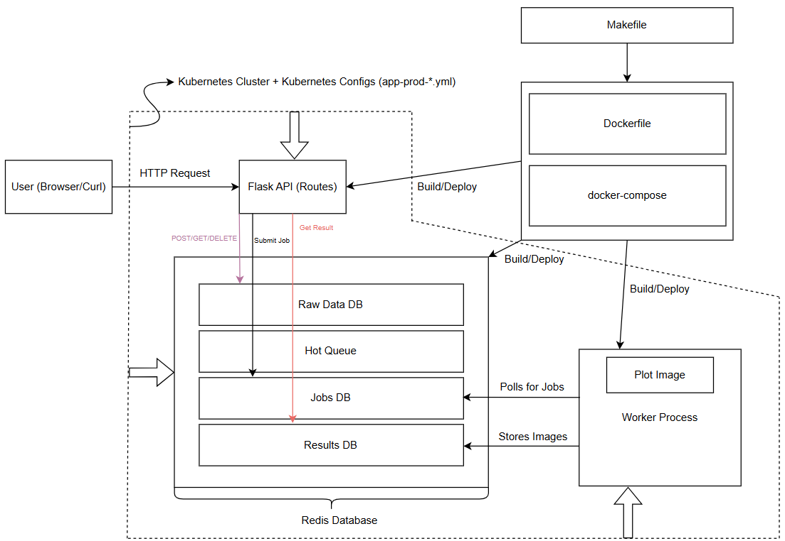

# Containerized REST API for Cancer Data Analysis

## Overview
This project visualizes and processes cancer-related data from a public Kaggle dataset using a distributed system architecture composed of a Flask API frontend and a Redis-backed job queue system. It is designed to be deployed both locally (e.g., Jetstream) and on a Kubernetes cluster.

The app receives user-submitted cancer data via a REST API, queues it with Redis, and spawns asynchronous workers to process the data and generate plots. These plots help explore patterns related to tumor malignancy and data distributions.

## Directory Contents
The `The-Songs-of-Distant-Final` directory contains twenty-nine (29) files:

- **`flask_api.py`**: Main Python script for loading, parsing, and processing the gene data.
- **`jobs.py`**: Secondary Python script put Jobs requests into a queue and a separately partitioned Redis database.
- **`worker.py`**: Tertiary Python script that pulls methods and requests from the Jobs API, as well as watching the queue and pulling off Job IDs as they arrive.
  
The three Python scripts described above are all stored in a **`src`** directory, in order to separate the source code from the configuration files.

- **`test_api.py`**: Tests the main Python script for loading, parsing, and processing the gene data.
- **`test_jobs.py`**: Tests the secondary Python script put Jobs requests into a queue and a separately partitioned Redis database.
- **`test_worker.py`**: Tests the terrtiary Python script that pulls methods and requests from the Jobs API, as well as watching the queue and pulling off Job IDs as they arrive.
  
The three Python scripts described above are all stored in a **`test`** directory, in order to separate the testing code from the configuration files.

- **`diagram.png`**: This illustrates the structure of the Cancer API Web Application, as well as the flow of data through the application. It shows where data originates, how it’s processed, where it’s stored, and how end users access it.
- **`.gitcanary`**: An essentially empty file that just serves to keep the Data directory tracked by Git. 
- **`requirements.txt`**: Lists the non-standard Python dependencies required by the Flask application (Flask, redis, and requests).
- **`Dockerfile`**: Contains the instructions for building the Flask application container. It uses the official Python 3.9-slim image, installs the necessary dependencies from requirements.txt, copies the source code, and exposes port 5000.
- **`README.md`**: This is documentation describing the project, its purpose, and instructions for use (also, the document you're reading right now! Hello!).
- **`docker-compose.yml`**: This file defines two services:
  - web: Builds the Flask application from the current directory, maps port 5000 on the host to port 5000 in the container, and declares a dependency on the Redis service.
  - redis: Uses the official Redis image (latest version) and maps port 6379 on the host to port 6379 in the container.

The above are the standard configuration files. The following are all in the **`Kubernetes`** directory, containing subfolders for each deployment environment. Each of these, **`prod`** and **`test`**, contains the full set of Kubernetes manifests needed to deploy your application stack (Flask API, Redis, and Worker) in their respective environments. Everything here comes in sets of three: Deployments (what runs your containers), Services (how your containers talk to each other or the outside), Ingress (how users access your app from the outside), Persistent Volume Claims (only Redis needs disk).

**`prod`**:
- **`app-prod-deployment-flask.yml`**
   - Deploys Flask API server
   - Sets environment variables and container image
   - Exposes port 5000 for internal communication
- **`app-prod-deployment-worker.yml`**
   - Deploys background job worker
   - Listens to Redis queue
   - Does not expose ports
- **`app-prod-deployment-redis.yml`**
   - Deploys Redis instance
   - Used for job queue and caching
   - Typically mounts persistent volume
- **`app-prod-service-flask.yml`**
   - Creates internal ClusterIP service for Flask
   - Used by Ingress or other pods to route to Flask
- **`app-prod-service-nodeport-flask.yml`**
   - Optional NodePort service for Flask
   - Exposes Flask on a static port across the cluster
   - Useful for testing without Ingress
- **`app-prod-service-redis.yml`**
   - ClusterIP service for Redis
   - Allows Flask and Worker to connect to Redis
- **`app-prod-pvc-redis.yml`**
   - Allocates persistent volume claim for Redis
   - Ensures Redis data is retained after restarts
- **`app-prod-ingress-flask.yml`**
   - Defines HTTP routing for external users to reach Flask
   - Uses host and path rules
   - Connects public traffic to internal Flask service

**`test`**:
- **`app-test-deployment-flask.yml`**
   - Same as prod but used in test environment
   - Enables safe validation before deploying to production
- **`app-test-deployment-worker.yml`**
   - Worker deployment for test environment
   - Matches prod behavior for job processing
- **`app-test-deployment-redis.yml`**
   - Redis deployment for test environment
   - Ensures isolation from production Redis
- **`app-test-service-flask.yml`**
   - Internal service for test Flask pod
   - Accessible within cluster only
- **`app-test-service-nodeport-flask.yml`**
   - Optional external access for Flask in test env
   - Exposes NodePort for manual testing
- **`app-test-service-redis.yml`**
   - ClusterIP service for Redis in test environment
   - Connects Flask and Worker in test cluster
- **`app-test-pvc-redis.yml`**
   - Persistent volume claim for Redis in test
   - Can simulate production disk behavior
- **`app-test-ingress-flask.yml`**
   - Ingress rules for accessing test Flask API externally
   - Allows HTTP access for testing via browser or curl

There is also a **`Makefile`**, which automates several common tasks as well as standardizes usage. 
- **`make build`**
Builds the Docker images for Flask API and worker containers
Equivalent to running docker compose build
- **`make up`**
Starts all services (Flask, Redis, Worker) using Docker Compose
Runs containers in foreground for active logging/debugging
- **`make down`**
Stops and removes all running containers and networks
Safe reset if services need to be restarted
- **`make logs`**
Tails the combined logs from all running containers
Useful for debugging background tasks or Flask requests
- **`make test`**
Runs all unit tests inside the containerized environment using pytest
Ensures application logic is functioning correctly

## Software Diagram


This illustrates the structure of the Cancer Dataset REST API Web Application, as well as the flow of data through the application. It shows where data originates, how it’s processed, where it’s stored, and how end users access it.

## Dataset Requirements
The data used in this project is sourced from the Kaggle website. Specifically, it is the Cancer Issue CSV (Comma Separated Value) file that this entire program is running off of.

## Deploying this App Using Docker Compose
- Clone or download this Git repository.
- Navigate to the root directory, where **`docker-compose.yml`** is located.
- Run **`docker compose up --build`** in order to deploy the web application.
- The Flask API will become available on **`127.0.0.1:5000`**.

## Running Locally/Jetstream

### Prerequisites
Ensure Python 3 and `pytest` are installed on your system. You can install `pytest` using:
```bash
pip install pytest
```

### Clone the Repository
Clone the `The-Songs-of-Distant-Final` repository from GitHub:
```bash
git clone https://github.com/sanatkumar1123/The-Songs-of-Distant-Final
```
Navigate to the `The-Songs-of-Distant-Final` directory:
```bash
cd The-Songs-of-Distant-Final
```
Set up Kaggle credentials:
```bash
export KAGGLE_USERNAME=your_username
export KAGGLE_KEY=your_key
```
Deploy with Docker Compose:
```bash
docker compose up --build
```
Access the API at:
```bash
http://localhost:5000
```

## Running Kubernetes Cluster
Build Docker image and push to Docker hub:
```bash
docker build -t your-dockerhub-username/The-Songs-of-Distant-Final .
docker push your-dockerhub-username/The-Songs-of-Distant-Final
```
Apply Kubernetes manifests (deployment.yaml, service.yaml, etc.):
```bash
kubectl apply -f k8s/
```
Forward port to access locally or expose via Ingress:
```bash
kubectl port-forward svc/flask-api 5000:5000
```

## Example API Routes and Usage
### POST /submit
- Submits cancer data for processing and plot generation. Expects JSON with numeric features like radius_mean, texture_mean, etc.
- Returns a job_id used to check job progress or retrieve the resulting graph.
```bash
   curl -X POST http://localhost:5000/submit \
  -H "Content-Type: application/json" \
  -d '{"radius_mean": 14.5, "texture_mean": 20.0, "perimeter_mean": 95.0}'
   ```
- An output would look something like:
```bash
{"job_id": "abc123"}
```
  
### GET /status/<job_id>
- Returns the current status of a submitted job. Possible values include "queued", "in-progress", and "complete".
```bash
   curl http://localhost:5000/status/abc123
   ```
- A response would look something like:
```bash
   {"status": "queued"}
   ```  

### GET /result/<job_id>
- Returns the result of a completed job. For graph-generating jobs, this may return the filename or path of the generated plot.
```bash
   curl http://localhost:5000/result/abc123
   ```
An example response would be:
```bash
   {"result": "tumor_plot.png"}
   ```
```bash
   curl http://localhost:5000/result/abc123 --output tumor_plot.png
   ```

### GET /graph/histogram
- Generates a histogram of a specific feature (e.g., radius_mean) across the dataset.
- Optional query parameters:
 - feature: The feature to graph (default is "radius_mean").
 - bins: Number of bins for the histogram (default is 10).
```bash
   curl "http://localhost:5000/graph/histogram?feature=radius_mean&bins=15" --output histogram.png
   ```

### GET /graph/scatter
- Generates a scatter plot of two features (e.g., radius_mean vs. texture_mean).
- Requires query parameters:
 - x: Feature on the x-axis.
 - y: Feature on the y-axis.
```bash
   curl "http://localhost:5000/graph/scatter?x=radius_mean&y=texture_mean" --output scatter.png
   ```

### Running Containerized Unit Tests
- Ensure the app containers are not currently running, or open a new terminal in the same directory as **`docker-compose.yml`**.
- Run **`docker compose run --rm app pytest`**; this will execute the unit tests within the container.
- If the tests pass, you should see a summary with zero failures.

This README aims to provide clear and concise instructions for anyone wishing to use, modify, or understand the ISS data analysis project.
